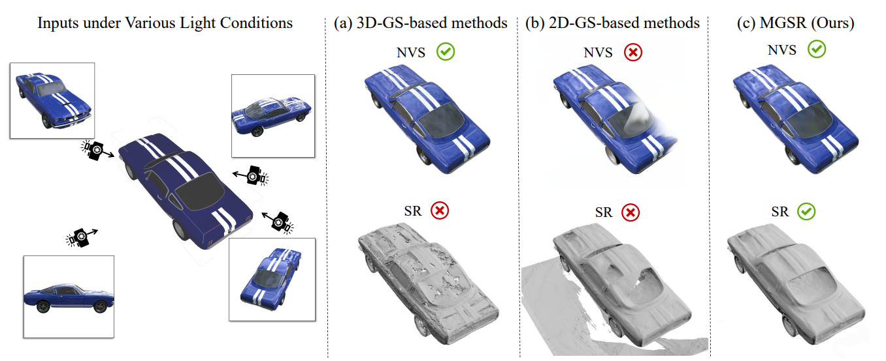
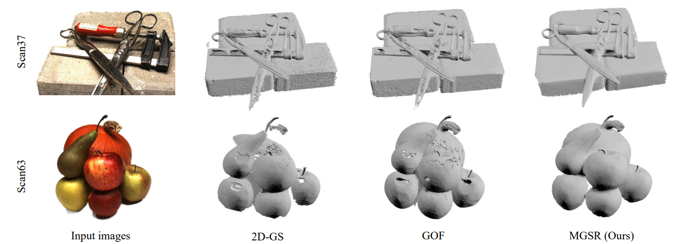

<h2 align="center"> <a href="https://arxiv.org/abs/2503.05182"> MGSR: 2D/3D Mutual-boosted Gaussian Splatting for High-fidelity Surface Reconstruction under Various Light Conditions </a>

<h5 align="center">

[](https://arxiv.org/abs/2503.05182)
[](https://github.com/TsingyuanChou/MGSR)
[](https://iccv.thecvf.com/Conferences/2025/AcceptedPapers)
<h5 align="center">
<h4 align="center">
Qingyuan Zhou, Yuehu Gong, Weidong Yang, Jiaze Li, Yeqi Luo, Baixin Xu, Shuhao Li, Ben Fei, Ying He

##

   
##


## Abstract
Novel view synthesis (NVS) and surface reconstruction (SR) are essential tasks in 3D Gaussian Splatting (3D-GS). Despite recent progress, these tasks are often addressed independently, with GS-based rendering methods struggling under diverse light conditions and failing to produce accurate surfaces, while GS-based reconstruction methods frequently compromise rendering quality. This raises a central question: must rendering and reconstruction always involve a trade-off? To address this, we propose MGSR, a 2D/3D Mutual-boosted Gaussian splatting for Surface Reconstruction that enhances both rendering quality and 3D reconstruction accuracy. MGSR introduces two branches--one based on 2D-GS and the other on 3D-GS. The 2D-GS branch excels in surface reconstruction, providing precise geometry information to the 3D-GS branch. Leveraging this geometry, the 3D-GS branch employs a geometry-guided illumination decomposition module that captures reflected and transmitted components, enabling realistic rendering under varied light conditions. Using the transmitted component as supervision, the 2D-GS branch also achieves high-fidelity surface reconstruction. Throughout the optimization process, the 2D-GS and 3D-GS branches undergo alternating optimization, providing mutual supervision. Prior to this, each branch completes an independent warm-up phase, with an early stopping strategy implemented to reduce computational costs. We evaluate MGSR on a diverse set of synthetic and real-world datasets, at both object and scene levels, demonstrating strong performance in rendering and surface reconstruction.

## Setup
**MGSR** is built on top of the [vanilla 3D Gaussian Splatting](https://github.com/graphdeco-inria/gaussian-splatting) and [2D Gaussian Splatting](https://github.com/hbb1/2d-gaussian-splatting). This project has been only tested on Ubuntu 20.04, NVIDIA A100 GPU(s), and CUDA-11.8. 
If you run into any problem while installation, you may refer to the [vanilla 3DGS code base](https://github.com/graphdeco-inria/gaussian-splatting), which provides detailed installation instructions.

### Installation


   ``` sh
   git clone --recursive https://github.com/TsingyuanChou/MGSR.git
   cd MGSR

   # if you have an environment used for 2DGS, use it
   conda activate 2DGS
   pip install refgs/sub/diff-gaussian-rasterization

   # if not, create a new environment
   conda env create --file environment.yml
   conda activate MGSR
   ```
## Dataset Preparation
### Data Structure
For real-world captured data:
```
<location>
|---images
|   |---<image 0>
|   |---<image 1>
|   |---...
|---masks
|   |---<image 0>
|   |---<image 1>
|   |---...
|---sparse
    |---0
        |---cameras.bin
        |---images.bin
        |---points3D.bin
```
For synthetic data:
```
<location>
|---images
|   |---<image 0>
|   |---<image 1>
|   |---...
|---masks
|   |---<image 0>
|   |---<image 1>
|   |---...
|---transforms_test.json
|---transforms_train.json
```
### Sample Data
Download the [OmniObject3D](https://github.com/omniobject3d/OmniObject3D) dataset used in this project [here](https://drive.google.com/file/d/1E27XNTDn6RPTGharJbLpCVjLT7VoGt54/view?usp=drive_link).

30 synthetic scenes from the OmniObject3D dataset are included. Each scene contains 100 images, which are randomly split into train and test sets at a 9:1 ratio (i.e., the transforms.json file is randomly divided into transforms_train.json and transforms_test.json).

## Running
### Simply Running
   ``` sh
   python train.py -s <Data_dir> -m <Output_dir>  # if synthetic data, use --geo_white_background
   python extract_mesh_tsdf.py -m <Output_dir>
   ```
### Reproducing
   ``` sh
   bash scripts/run_oo3d.sh
   bash scripts/run_DTU.sh
   ```
##


### Parallel Running
(WIP) Coming soon.

## Acknowledgement

This work is partially built on [3DGS](https://github.com/graphdeco-inria/gaussian-splatting) and [2DGS](https://github.com/hbb1/2d-gaussian-splatting). For a fair comparison with GOF, the TSDF implementation in the paper is consistent with that of [GOF](https://github.com/autonomousvision/gaussian-opacity-fields), rather than TSDF used in 2DGS. The implementation of the TV loss follows [GS-IR](https://github.com/lzhnb/GS-IR). 

If you find this work useful, please kindly cite our paper.
<section class="section" id="BibTeX">
  <div class="container is-max-desktop content">
    <h2 class="title">BibTeX</h2>
    <pre><code>@article{zhou2025mgsr,
  title={MGSR: 2D/3D Mutual-boosted Gaussian Splatting for High-fidelity Surface Reconstruction under Various Light Conditions},
  author={Zhou, Qingyuan and Gong, Yuehu and Yang, Weidong and Li, Jiaze and Luo, Yeqi and Xu, Baixin and Li, Shuhao and Fei, Ben and He, Ying},
  journal={arXiv preprint arXiv:2503.05182},
  year={2025}
}</code></pre>
  </div>
</section>
